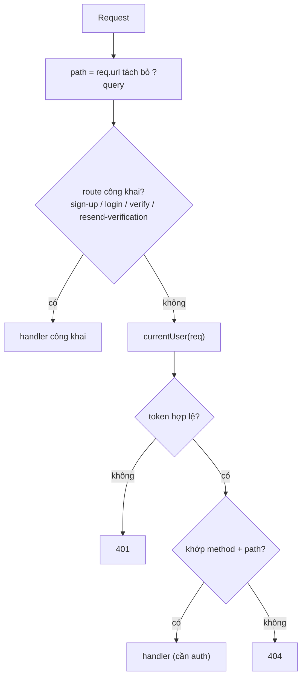
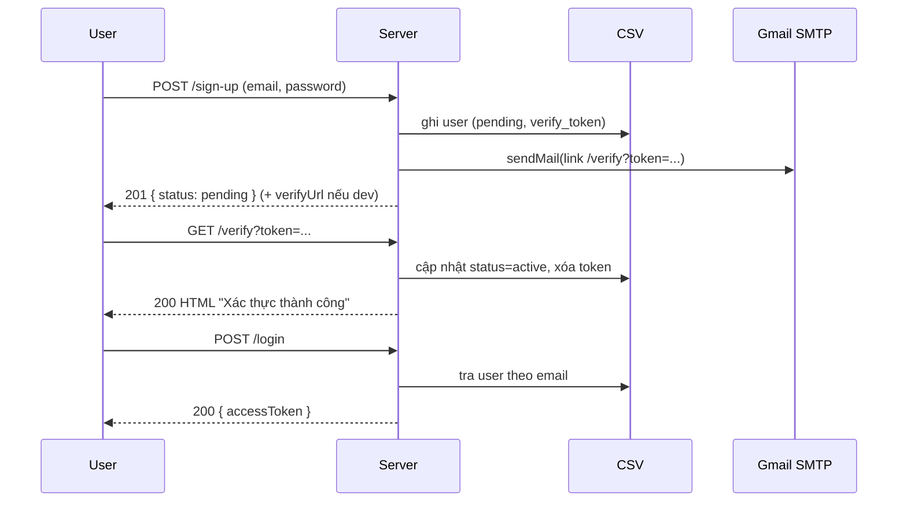

# Luồng chạy của Auth + Task REST API

Tài liệu này giải thích server khởi động thế nào, một request đi qua đâu, và vai trò từng file.

## 1. Cây file

```
backend/
  src/
    index.js  # entry: tạo HTTP server, routing (if/else), tất cả handler
    store.js  # lớp dữ liệu: engine CSV tự dựng (index RAM, ghi dạng snapshot)
    auth.js   # hash password (scrypt) + tạo/kiểm tra access token (HMAC)
    mailer.js # gửi email xác thực qua nodemailer (Gmail SMTP)
  scripts/
    seed.js   # seed N user vào users.csv
    bench.js  # đo chi phí sign-up
  test/
    smoke.js  # chạy server trên port + data tạm, test toàn bộ endpoint
  data/       # users.csv, tasks.csv (tự tạo, đã gitignore)

frontend/
  html/       # login.html (auth), index.html (task)
  css/        # base.css (tokens), auth.css, app.css
  js/         # auth.js, app.js
```

`index.js` phục vụ luôn `frontend/` tại `/frontend/*` (cùng origin), nên mở `http://localhost:3000/frontend/html/login.html`.

Phụ thuộc: `index.js` → `store.js` + `auth.js` + `mailer.js`. Ba file kia không phụ thuộc lẫn nhau.

## 2. Khởi động (`index.js`)

```js
const http = require('http');
const db = require('./store');
const auth = require('./auth');
const mailer = require('./mailer');
const PORT = Number(process.env.PORT || 3000);

const server = http.createServer(handler);
server.listen(PORT, () => console.log(`Server running at http://localhost:${PORT}`));
```

`store.js` nạp `data/users.csv` + `data/tasks.csv` vào index RAM ngay khi `require`.

## 3. Vòng đời request



1. Lấy `method` và `path` (`req.url.split('?')[0]`).
2. **File tĩnh**: `GET /frontend/*` → phục vụ file trong `../frontend` (chặn path traversal).
3. **Route công khai**: `POST /sign-up`, `POST /login`, `GET /verify`, `POST /resend-verification`.
4. **Xác thực**: `currentUser(req)` đọc header `Authorization: Bearer <token>`, verify, tra user. Thiếu/sai → `401`.
5. **Route cần auth**: so `method` + `path` bằng `if/else` (dùng `startsWith` cho path có `:id`).
6. Không khớp → `404`. Mọi lỗi bắt ở `catch` → trả `err.status || 500`.

## 4. `auth.js`

| Hàm | Việc |
|-----|------|
| `hashPassword(password)` | salt ngẫu nhiên 16 byte + scrypt 64 byte → `{ salt, hash }` |
| `hashPasswordAsync(password)` | như trên nhưng chạy trên threadpool (không chặn event loop) |
| `checkPassword(password, salt, hash)` | tính lại hash và so sánh |
| `randomToken()` | 32 byte ngẫu nhiên → hex, dùng cho token xác thực email |
| `createToken(userId)` | payload `{ sub, exp }` → base64url, ký HMAC-SHA256 → `body.signature` |
| `readToken(token)` | kiểm chữ ký + `exp`; hợp lệ trả `sub` (id user), ngược lại `null` |

Token **stateless** (server không lưu). Đổi `JWT_SECRET` ⇒ token cũ vô hiệu. Cost scrypt chỉnh qua `SCRYPT_N`.

## 5. `store.js` (engine CSV tự dựng)

Không DB engine. Hai file CSV ở dạng **snapshot**: header + **đúng 1 dòng cho mỗi user/task** (không còn `op`, không có dòng trùng).

- **Boot**: `loadCsv` đọc file theo chunk 1MB, lấy header **từ chính file** → `applyUserRow`/`applyTaskRow` nạp vào `Map` (`usersById`, `usersByEmail`, `usersByToken`, `tasksById`, `tasksByUser`) + `nextId`. File cũ dạng log (cột `op`) vẫn đọc được và sẽ được nén lại thành snapshot ở lần `flush` kế tiếp.
- **Đọc** (mọi hàm `get*`/`list*`): thuần RAM, O(1) — vd check email trùng = `usersByEmail.get(...)`.
- **Ghi** (`createUser`, `activateUser`, `setPasswordHash`, `createTask`, `updateTask`, `assignTask`…): sửa RAM + bật cờ dirty; **`flush()` định kỳ** (`FLUSH_MS`, mặc định 200ms) ghi lại **toàn bộ file dạng snapshot** (ghi ra `.tmp` rồi `rename` — atomic, không thấy file dở); khi `exit`/`SIGINT`/`SIGTERM` dùng `flushSync()`. Request path **không đụng đĩa**.
- CSV helpers: `escapeValue` / `toCsvLine` (hỗ trợ `,` `"` `\n`). `loadCsv` là parser **có state**: theo dõi dấu ngoặc xuyên dòng (giá trị chứa `\n` vẫn đọc đúng) và giải mã chunk bằng `StringDecoder` (ký tự multibyte vắt qua mốc 1MB không bị hỏng).
- API giữ nguyên nên `index.js` không phải sửa: users: `getUserById`, `getUserByEmail`, `getUserByVerifyToken`, `createUser`, `activateUser`, `setVerifyToken`, `setPasswordHash`, `deleteUser`, `listUsers(limit, offset)`, `countUsers`, `countUserTasks`; tasks: `findTaskById`, `listUserTasks`, `createTask`, `updateTask`, `assignTask`, `deleteTask`.

## 6. `mailer.js`

- Đọc cấu hình `SMTP_*` từ env; nếu thiếu → không tạo transporter (**dev mode**).
- `sendVerificationEmail(email, token)`: gửi mail chứa `${BASE_URL}/verify?token=...`; dev mode thì `console.log` link. Trả `{ delivered, link }`.

## 7. Handler trong `index.js`

| Endpoint | Hàm | Logic |
|----------|-----|-------|
| `POST /sign-up` | `signUp` (async) | validate email + password; trùng → `409` (trừ bản ghi rác hash rỗng — ghi đè); insert user `pending` (hash rỗng) → trả `201` **ngay**; băm mật khẩu (bất đồng bộ, id vào `pendingHashes`) + gửi mail ở nền |
| `POST /login` | `login` | tra user + `checkPassword`; sai → `401`; `status !== active` → `403`; đúng → trả `accessToken` |
| `GET /verify` | `verifyEmail` | tra theo token; sai → `404`, hết hạn → `410`; hợp lệ → `activateUser` → HTML |
| `POST /resend-verification` | `resendVerification` | tạo token mới + gửi lại; không lộ email có tồn tại hay không |
| `GET /me` | (inline) | trả `publicUser(user)` |
| `GET /users` | (inline) | phân trang `?limit&offset` → `{ total, limit, offset, items }` |
| `GET /user/:id` | (inline) | trả `publicUser` của 1 user; không thấy → `404` |
| `DELETE /user/:id` | `deleteUser` | không thấy `404`; còn task `409`; ngược lại `204` |
| `POST /task` | `createTask` | cần `title`; task mới `user_id = null`, `created_by` = user token → `201` |
| `GET /tasks` | (inline) | `listTasks()` — board dùng chung, trả **tất cả** task |
| `PATCH /task/:id` | `updateTask` | merge title/done + (tùy chọn) `user_id` → `200` |
| `DELETE /task/:id` | `deleteTask` | xóa task → `204` |
| `PATCH /assign-task/:id` | `assignTask` | body `{ user_id }`; task/user không tồn tại → `404`; đổi chủ sở hữu → `200` |

## 8. Vòng đời xác thực email



## 9. Ghi chú

- **Routing**: if/else trên `method` + `path`; path có `:id` dùng `startsWith` + `idFrom`. Sai method → coi như `404`.
- **CSV engine**: tra cứu O(1) trên Map; seed 1M user ~4s; ghi dạng snapshot, tự nén file ở lần flush đầu.
- **5ms**: nút thắt là scrypt (`SCRYPT_N`), không phải DB. Xem mục "Hiệu năng" trong README.
- **Bảo mật (bài tập)**: so sánh chữ ký/hash bằng `===` cho dễ hiểu (bản production nên dùng `crypto.timingSafeEqual`).
