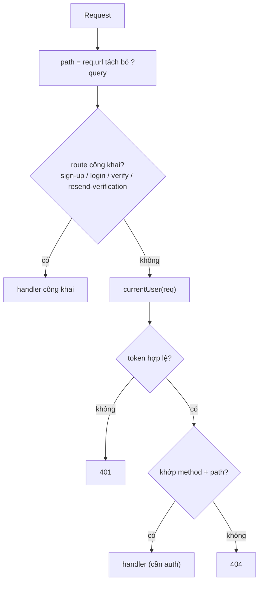
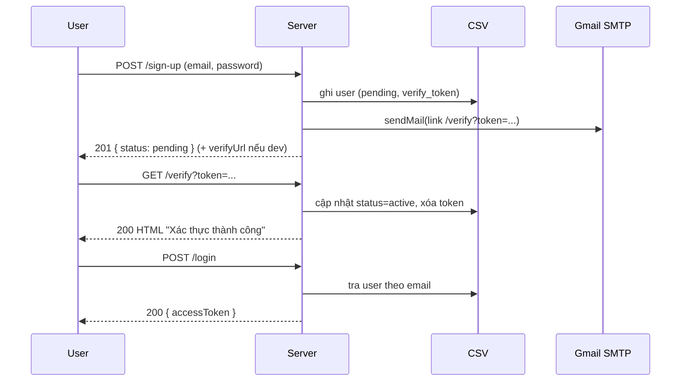

# Luồng chạy của Auth + Task REST API

Tài liệu này giải thích server khởi động thế nào, một request đi qua đâu, và vai trò từng file.

## 1. Cây file

```
backend/
  src/
    index.js  # entry: tạo HTTP server, routing (if/else), tất cả handler
    store.js  # lớp dữ liệu: file CSV fixed-length (index trong RAM, ghi tại chỗ)
    auth.js   # hash password (scrypt) + tạo/kiểm tra access token (HMAC)
    mailer.js # gửi email xác thực qua nodemailer (Gmail SMTP)
  scripts/
    seed.js   # seed N user vào users.csv
    bench.js  # đo chi phí sign-up
    migrate-to-fixed.js  # chuyển data cũ (variable-length) sang fixed-length
  test/
    smoke.js  # chạy server trên port + data tạm, test toàn bộ endpoint
  data/       # users.csv, tasks.csv (tự tạo, đã gitignore)

frontend/
  html/       # login.html (auth), index.html (task)
  css/        # base.css (tokens), auth.css, app.css
  js/         # auth.js, app.js
```

`index.js` chỉ chạy API; frontend mở trực tiếp từ đĩa (script gọi API tại `http://localhost:3000`, CORS đã mở).

Phụ thuộc: `index.js` → `store.js` + `auth.js` + `mailer.js`. Ba file kia không phụ thuộc lẫn nhau.

## 2. Khởi động (`index.js`)

```js
const http = require('http');
const db = require('./store');
const auth = require('./auth');
const mailer = require('./mailer');
const PORT = Number(process.env.PORT || 3000);

const server = http.createServer(handler);
server.listen(PORT, () => console.log(`Server running at http://localhost:${PORT}`));
```

`store.js` nạp `data/users.csv` + `data/tasks.csv` vào index RAM ngay khi `require`.

## 3. Vòng đời request



1. Lấy `method` và `path` (`req.url.split('?')[0]`).
2. **Route công khai**: `POST /sign-up`, `POST /login`, `GET /verify`, `POST /resend-verification`.
3. **Xác thực**: `currentUser(req)` đọc header `Authorization: Bearer <token>`, verify, tra user. Thiếu/sai → `401`.
4. **Route cần auth**: so `method` + `path` bằng `if/else` (dùng `startsWith` cho path có `:id`).
5. Không khớp → `404`. Mọi lỗi bắt ở `catch` → trả `err.status || 500`.

## 4. `auth.js`

| Hàm | Việc |
|-----|------|
| `hashPassword(password)` | salt ngẫu nhiên 16 byte + scrypt 64 byte → `{ salt, hash }` |
| `hashPasswordAsync(password)` | như trên nhưng chạy trên threadpool (không chặn event loop) |
| `checkPassword(password, salt, hash)` | tính lại hash và so sánh |
| `randomToken()` | 32 byte ngẫu nhiên → hex, dùng cho token xác thực email |
| `createToken(userId)` | payload `{ sub, exp }` → base64url, ký HMAC-SHA256 → `body.signature` |
| `readToken(token)` | kiểm chữ ký + `exp`; hợp lệ trả `sub` (id user), ngược lại `null` |

Token **stateless** (server không lưu). Đổi `JWT_SECRET` ⇒ token cũ vô hiệu.

## 5. `store.js` (engine CSV tự dựng)

Không DB engine. Hai file CSV dạng **fixed-length**: mọi dòng dài bằng nhau, nên dòng `id` ở offset `(id-1) × ROW` — tra bằng số học, ghi đè tại chỗ.

- **Boot**: `loadUsers`/`loadTasks` quét file theo chunk (512 dòng/lần) và **chỉ dựng index** trong RAM (`emailToId`, `tokenToId`, `tasksByUser`, `usersSlots`/`tasksSlots`, `nextId`). Nội dung dòng **không** giữ trong RAM.
- **Đọc** (`get*`/`list*`): `email → id` là tra Map; lấy dòng thì `readRow` seek `(id-1) × ROW` và giải mã 1 dòng.
- **Ghi** (`createUser`, `activateUser`, `setPasswordHash`, `createTask`, `updateTask`, `assignTask`…): `create` nối 1 dòng cuối file, `update` ghi đè đúng offset; cập nhật index. Mỗi thay đổi ghi **đồng bộ 1 dòng** (không dirty/flush định kỳ); `flush()` chỉ `fsync` (gọi khi exit/SIGINT/SIGTERM).
- Codec: `encodeRow` (pad ô bằng space đủ độ rộng, chèn `,` ở vị trí cố định) / `decodeRow` (cắt theo **byte offset**, dấu phẩy trong giá trị vẫn an toàn). Vượt độ rộng → `400` từ `index.js` (`email` ≤ 64, `title` ≤ 128 byte).
- API giữ nguyên nên `index.js` chỉ thêm validate độ dài: users: `getUserById`, `getUserByEmail`, `getUserByVerifyToken`, `createUser`, `activateUser`, `setVerifyToken`, `setPasswordHash`, `deleteUser`, `listUsers(limit, offset)`, `countUsers`, `countUserTasks`; tasks: `findTaskById`, `listUserTasks`, `createTask`, `updateTask`, `assignTask`, `deleteTask`.

> File cũ dạng snapshot (variable-length + header) được chuyển một lần bằng `scripts/migrate-to-fixed.js`.

## 6. `mailer.js`

- Đọc cấu hình `SMTP_*` từ env; nếu thiếu → không tạo transporter (**dev mode**).
- `sendVerificationEmail(email, token)`: gửi mail chứa `${BASE_URL}/verify?token=...`; dev mode thì `console.log` link. Trả `{ delivered, link }`.

## 7. Handler trong `index.js`

| Endpoint | Hàm | Logic |
|----------|-----|-------|
| `POST /sign-up` | `signUp` (async) | validate email + password; trùng → `409` (trừ bản ghi rác hash rỗng — ghi đè); insert user `pending` (hash rỗng) → trả `201` **ngay**; băm mật khẩu (bất đồng bộ, id vào `pendingHashes`) + gửi mail ở nền |
| `POST /login` | `login` | tra user + `checkPassword`; sai → `401`; `status !== active` → `403`; đúng → trả `accessToken` |
| `GET /verify` | `verifyEmail` | tra theo token; sai → `404`, hết hạn → `410`; hợp lệ → `activateUser` → HTML |
| `POST /resend-verification` | `resendVerification` | tạo token mới + gửi lại; không lộ email có tồn tại hay không |
| `GET /me` | (inline) | trả `publicUser(user)` |
| `GET /users` | (inline) | phân trang `?limit&offset` → `{ total, limit, offset, items }` |
| `GET /user/:id` | (inline) | trả `publicUser` của 1 user; không thấy → `404` |
| `DELETE /user/:id` | `deleteUser` | không thấy `404`; còn task `409`; ngược lại `204` |
| `POST /task` | `createTask` | cần `title`; task mới `user_id = null`, `created_by` = user token → `201` |
| `GET /tasks` | (inline) | `listTasks()` — board dùng chung, trả **tất cả** task |
| `PATCH /task/:id` | `updateTask` | merge title/done + (tùy chọn) `user_id` → `200` |
| `DELETE /task/:id` | `deleteTask` | xóa task → `204` |
| `PATCH /assign-task/:id` | `assignTask` | body `{ user_id }`; task/user không tồn tại → `404`; đổi chủ sở hữu → `200` |

## 8. Vòng đời xác thực email



## 9. Ghi chú

- **Routing**: if/else trên `method` + `path`; path có `:id` dùng `startsWith` + `idFrom`. Sai method → coi như `404`.
- **Store**: rows fixed-length, `id = slot + 1`; tra cứu O(1) qua index RAM; ghi đè 1 dòng tại chỗ (không ghi lại cả file).
- **5ms**: nút thắt là scrypt, không phải DB. Xem mục "Hiệu năng" trong README.
- **Bảo mật (bài tập)**: so sánh chữ ký/hash bằng `===` cho dễ hiểu (bản production nên dùng `crypto.timingSafeEqual`).
