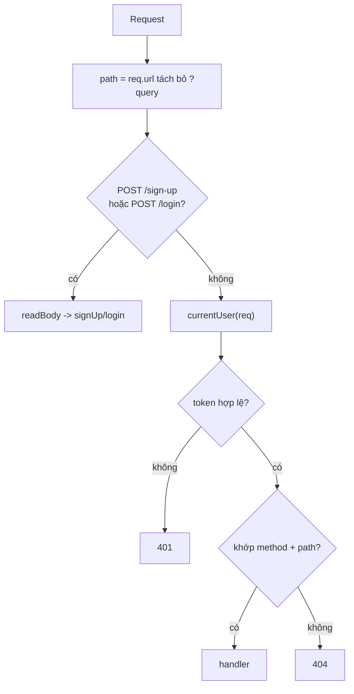

# Luồng chạy của Auth + Task REST API

Tài liệu này giải thích server khởi động thế nào, một request đi qua đâu, và vai trò từng file. Code chỉ có **3 file chính**, routing bằng `if/else` nên đọc từ trên xuống là hiểu.

## 1. Cây file

```
backend/
  index.js    # entry: tạo HTTP server, routing (if/else), tất cả handler
  store.js    # lớp dữ liệu: đọc/ghi CSV, truy vấn users/tasks
  auth.js     # hash password (scrypt) + tạo/kiểm tra access token (HMAC)
  test/
    smoke.js  # chạy server trên port + data tạm, test toàn bộ endpoint
  data/       # users.csv, tasks.csv (tự tạo, đã gitignore)
```

Phụ thuộc: `index.js` → `store.js` + `auth.js`. Hai file kia không phụ thuộc lẫn nhau.

## 2. Khởi động (`index.js`)

```js
const http = require('http');
const db = require('./store');
const auth = require('./auth');
const PORT = Number(process.env.PORT || 3000);

const server = http.createServer(handler);
server.listen(PORT, () => console.log(`Server running at http://localhost:${PORT}`));
```

- `http.createServer(handler)`: mỗi request gọi `handler(req, res)`.
- `server.listen`: bắt đầu nhận kết nối ở `PORT`.

## 3. Vòng đời request



Trình tự trong handler của `index.js`:

1. Lấy `method` và `path` (`req.url.split('?')[0]`).
2. **Route công khai**: `POST /sign-up`, `POST /login` → đọc body rồi gọi handler.
3. **Xác thực**: `currentUser(req)` đọc header `Authorization: Bearer <token>`, verify, tra user. Thiếu/sai → `401`.
4. **Route cần auth**: so `method` + `path` bằng `if/else` (dùng `startsWith` cho path có `:id`), gọi handler.
5. Không khớp → `404`.
6. Mọi lỗi bắt ở `catch` → trả `err.status || 500`.

Xác thực:

```js
function currentUser(req) {
  const header = req.headers.authorization || '';
  const token = header.startsWith('Bearer ') ? header.slice(7) : '';
  const userId = auth.readToken(token);
  return userId ? db.findUserById(userId) : null;
}
```

Tra user trong DB để token của user **đã bị xoá** cũng bị chặn.

## 4. `auth.js`

| Hàm | Việc |
|-----|------|
| `hashPassword(password)` | salt ngẫu nhiên 16 byte + scrypt 64 byte → `{ salt, hash }` |
| `checkPassword(password, salt, hash)` | tính lại hash và so sánh |
| `createToken(userId)` | payload `{ sub, exp }` → base64url, ký HMAC-SHA256 → `body.signature` |
| `readToken(token)` | kiểm chữ ký + `exp`; hợp lệ trả `sub` (id user), ngược lại `null` |

Token **stateless** (server không lưu). Đổi `JWT_SECRET` ⇒ token cũ vô hiệu.

## 5. `store.js`

- Hằng: `DATA_DIR` (đổi được qua env `DATA_DIR`), `USERS_FILE`, `TASKS_FILE`, và header của 2 bảng.
- CSV: `escapeValue` (bọc quote khi có `,` `"` xuống dòng), `splitLine` (tách field có quote), `readRows`, `writeRows` (ghi đè cả file), `nextId`.
- `getUsers` / `getTasks`: đọc file → mảng object (ép `id`, `user_id` sang number; `user_id` rỗng → `null`).
- API dùng bởi `index.js`:
  - users: `findUserById`, `findUserByUsername`, `createUser`, `deleteUser`, `countUserTasks`
  - tasks: `listUserTasks`, `findTaskById`, `createTask`, `assignTask`, `deleteTask`

Mỗi thao tác ghi là **read → sửa mảng → ghi đè file** (đơn giản, không an toàn khi ghi đồng thời).

## 6. Handler trong `index.js`

| Endpoint | Hàm | Logic |
|----------|-----|-------|
| `POST /sign-up` | `signUp` | validate (≥3/≥6), trùng → `409`, hash + `createUser` → `201` |
| `POST /login` | `login` | tìm user + `checkPassword`; sai → `401`; đúng → trả `accessToken` |
| `GET /me` | (inline) | trả `publicUser(user)` |
| `DELETE /user/:id` | `deleteUser` | không thấy `404`; còn task `409`; ngược lại `204` |
| `POST /task` | `createTask` | cần `title`; `user_id` = user từ token → `201` |
| `GET /tasks` | (inline) | `listUserTasks(user.id)` |
| `PATCH /assign-task/:id` | `assignTask` | body `{ user_id }`; task/user không tồn tại → `404`; đổi chủ sở hữu → `200` |
| `DELETE /task/:id` | `deleteTask` | không sở hữu → `403`; ngược lại `204` |

## 7. Trace ví dụ

**`POST /login`**

1. `path === '/login'` → `readBody(req)` → `login(res, body)`.
2. `db.findUserByUsername` → `auth.checkPassword`.
3. Đúng → `auth.createToken(user.id)` → `send(res, 200, { accessToken, ... })`.

**`GET /tasks` (có token)**

1. `currentUser(req)`: `readToken` → `db.findUserById` → có user.
2. `path === '/tasks'` → `send(res, 200, db.listUserTasks(user.id))` → chỉ task của mình.

**`DELETE /user/1` khi còn task**

1. `currentUser` OK → `path.startsWith('/user/')` → `idFrom(path, '/user/')` = 1.
2. `deleteUser(res, 1)`: `countUserTasks(1) > 0` → `fail(res, 409, ...)`; không ghi file.

## 8. Ghi chú

- **Routing**: if/else trên `method` + `path`; path có `:id` dùng `startsWith` + `idFrom`. Sai method → coi như `404`.
- **CSV tối giản**: xử lý dấu phẩy và dấu `"`; **không** hỗ trợ field chứa xuống dòng.
- **Token**: ký HMAC bằng `crypto` built-in, không cần thư viện JWT.
- **Bảo mật (bài tập)**: so sánh chữ ký/hash bằng `===` cho dễ hiểu (bản production nên dùng `crypto.timingSafeEqual`).
