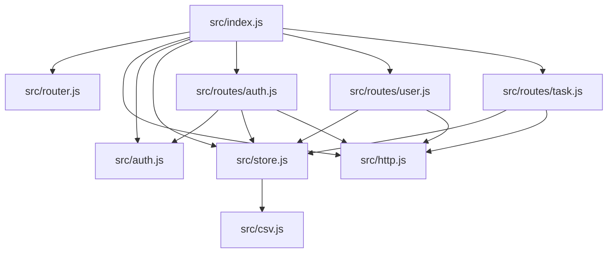
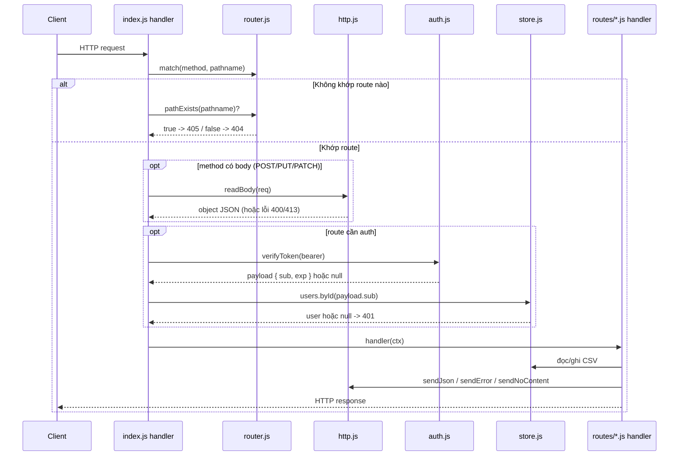

# Luồng chạy của Auth + Task REST API

Tài liệu này giải thích **server khởi động thế nào**, **một request đi qua những file nào**, và **vai trò của từng file/path**. Dùng kèm với code trong `src/`.

## 1. Cây file và vai trò

```
server/
  src/
    index.js          # Điểm khởi động (entry). Tạo HTTP server, điều phối request,
                      # chạy "middleware" xác thực, bắt lỗi tập trung.
    router.js         # Router mini: đăng ký route, khớp method + path, tách params /:id.
    http.js           # Helper tầng HTTP: gửi JSON, gửi lỗi, 204, đọc & parse body.
    auth.js           # Bảo mật: hash/verify password (scrypt), ký & kiểm tra access token (HMAC).
    csv.js            # Đọc/ghi CSV: parse chuỗi CSV thành mảng, stringify mảng thành CSV.
    store.js          # Lớp dữ liệu: truy vấn/ghi users.csv và tasks.csv, cấp id, ẩn field nhạy cảm.
    routes/
      auth.js         # Handler cho endpoint công khai: POST /sign-up, POST /login.
      user.js         # Handler user: GET /me, DELETE /user/:id.
      task.js         # Handler task: POST /task, GET /tasks, PATCH /assign-task/:id, DELETE /task/:id.
  test/
    smoke.js          # Chạy server trên port + data tạm, test toàn bộ 8 endpoint.
  data/
    users.csv         # Bảng user (tự tạo lúc chạy, đã gitignore).
    tasks.csv         # Bảng task (tự tạo lúc chạy, đã gitignore).
  package.json        # Metadata + script npm start / npm run dev.
  .env.example        # Mẫu biến môi trường (PORT, JWT_SECRET, ACCESS_TOKEN_TTL).
  .gitignore          # Bỏ qua node_modules, .env, data/*.csv.
  README.md           # Hướng dẫn chạy + danh sách endpoint + cURL.
  FLOW.md             # File này.
```

## 2. Quan hệ phụ thuộc (ai gọi ai)



- Chỉ `index.js` biết tất cả; các route chỉ biết `store`, `http` (và `auth` nếu là route công khai).
- `auth.js` và `csv.js` là lá (leaf), không phụ thuộc file nội bộ nào khác.

## 3. Khởi động server (`src/index.js`)

Khi chạy `node src/index.js`:

1. `require` các module: `router`, `http`, `auth`, `store`.
2. Tạo `router = new Router()`.
3. Gọi `register(router)` của 3 nhóm route — mỗi lần gọi sẽ đăng ký các cặp method/path vào router:

   ```js
   require('./routes/auth').register(router);  // /sign-up, /login  (public)
   require('./routes/user').register(router);  // /me, /user/:id
   require('./routes/task').register(router);  // /task, /tasks, /assign-task/:id, /task/:id
   ```

4. Đọc `PORT` (mặc định `3000`), tạo server bằng `http.createServer(handler)`.
5. `server.listen(PORT)` → in dòng `Auth + Task REST API dang chay tai http://localhost:3000`.

## 4. Vòng đời một request (trong `handler` của `index.js`)



Chi tiết từng bước:

1. **Parse URL**: `new URL(req.url, 'http://localhost')` để lấy `pathname`.
2. **Khớp route**: `router.match(req.method, url.pathname)`.
   - Nếu không khớp: nếu path có tồn tại với method khác → `405`, ngược lại → `404`.
3. **Đọc body**: với `POST`/`PUT`/`PATCH`, gọi `readBody(req)`. Body không phải JSON hợp lệ → `400`; quá 1MB → `413`.
4. **Xác thực** (chỉ route không `public`): lấy token qua `extractBearer(headers.authorization)`, kiểm tra bằng `verifyToken`, rồi tra user bằng `store.users.byId(payload.sub)`. Thiếu/sai/hết hạn → `401`.
5. **Tạo `ctx`** gồm `{ req, res, url, params, body, user }` rồi `await route.handler(ctx)`.
6. **Bắt lỗi tập trung**: mọi exception rơi vào `catch`, trả `error.status || 500` cùng message. Nếu response đã gửi (`headersSent`) thì chỉ `res.end()`.

## 5. `src/router.js`

- `add(method, pattern, handler, options)`: biến `pattern` (vd `/task/:id`) thành regex.
  - Escape ký tự đặc biệt, đổi `:id` → `([^/]+)` và ghi nhớ tên param.
  - `options.public === true` đánh dấu route không cần auth.
  - Regex có `/?$` → chấp nhận cả path có/không có dấu `/` cuối.
- `match(method, pathname)`: trả `{ handler, params, public }`; `params` được `decodeURIComponent`. Không khớp → `null`.
- `pathExists(pathname)`: dùng để phân biệt `405` (sai method) và `404` (sai path).

## 6. `src/http.js`

| Hàm | Việc làm |
|-----|----------|
| `sendJson(res, status, data)` | Ghi header `Content-Type: application/json`, `Content-Length`, `res.end(JSON.stringify(data))`. |
| `sendError(res, status, message)` | Gọi `sendJson` với `{ error: message }`. |
| `sendNoContent(res)` | `res.writeHead(204)` rồi kết thúc (không body). |
| `readBody(req)` | Gom `data`/`end`, giới hạn 1MB (→ lỗi `413`), `JSON.parse` (lỗi → `400`); body rỗng trả `{}`. |

## 7. `src/auth.js`

- Hằng: `SECRET` (từ `JWT_SECRET`, mặc định `dev-secret-change-me`), `ACCESS_TTL_SECONDS` (từ `ACCESS_TOKEN_TTL`, mặc định `3600`).
- `hashPassword(password, salt?)`: sinh salt ngẫu nhiên (hoặc dùng salt truyền vào), trả `{ salt, hash }` với `hash = scrypt(password, salt, 64)`.
- `verifyPassword(password, salt, expectedHash)`: tính lại hash rồi so sánh bằng `crypto.timingSafeEqual` (chống timing attack).
- `signToken(userId, ttl)`: payload `{ sub: userId, exp: now + ttl }` → base64url + chữ ký HMAC-SHA256 → chuỗi `body.signature`.
- `verifyToken(token)`: kiểm tra định dạng, so chữ ký (timingSafeEqual), giải mã payload, kiểm tra `exp` chưa hết hạn và có `sub`. Sai bất kỳ bước nào → `null`.

## 8. `src/csv.js`

- `parse(text)`: máy trạng thái đọc từng ký tự, hỗ trợ field bọc trong `"..."` (chứa được dấu phẩy, `""` và xuống dòng). Bỏ BOM, bỏ `\r`. Trả về mảng các dòng (mảng các field).
- `stringify(rows)`: mỗi field đi qua `escapeField` (bọc `"` và nhân đôi `"` nếu cần), nối bằng `,`, kết thúc bằng `\n`.

## 9. `src/store.js`

- `DATA_DIR`: lấy từ biến `DATA_DIR` (nếu có, dùng trong test) hoặc `server/data`.
- `ensureFile`: tạo thư mục + file CSV kèm dòng header nếu chưa tồn tại.
- `readRecords(file, columns)`: đọc file → `csv.parse` → bỏ dòng header → map sang object theo tên cột.
- `writeRecords(file, columns, records)`: ghi lại **toàn bộ** file (header + mọi dòng).
- `nextId(records)`: `max(id) + 1`.
- `readUsers` / `readTasks`: ép kiểu (`id`, `user_id` → number; `user_id` rỗng → `null`).

API công khai:

| Nhóm | Hàm | Ý nghĩa |
|------|-----|---------|
| `users` | `all`, `byId(id)`, `byUsername(username)`, `create({username, passwordHash, salt})`, `remove(id)` | CRUD user |
| `tasks` | `byUser(userId)`, `byId(id)`, `countByUser(userId)`, `create({title, description, userId})`, `assign(taskId, userId)`, `remove(id)` | CRUD + đếm + gán task |
| — | `publicUser(user)` | Loại bỏ `password_hash` và `salt`, chỉ trả `id`, `username`, `created_at`. |

## 10. `src/routes/*.js`

Mỗi file export `register(router)` để gắn handler vào router. Handler là `async (ctx) => ...` và **tự gửi response** bằng helper trong `http.js`.

### `routes/auth.js` (public)

- `POST /sign-up` → `signUp`: validate `username` (≥3), `password` (≥6), kiểm tra trùng (`409`), `hashPassword` → `store.users.create` → `201` + `publicUser`.
- `POST /login` → `login`: tìm user theo username, `verifyPassword` (sai → `401`), `signToken` → `200` + `{ accessToken, tokenType, expiresIn }`.

### `routes/user.js`

- `GET /me` → `me`: trả `publicUser(ctx.user)`.
- `DELETE /user/:id` → `removeUser`: validate `id`, tìm user (`404`), nếu `tasks.countByUser(id) > 0` → `409`, ngược lại `users.remove` → `204`.

### `routes/task.js`

- `POST /task` → `createTask`: cần `title`; tạo task với `user_id = ctx.user.id` → `201`.
- `GET /tasks` → `listTasks`: trả `tasks.byUser(ctx.user.id)`.
- `PATCH /assign-task/:id` → `assignTask`: tìm task (`404`), gán `user_id = ctx.user.id` → `200` (không kiểm tra sở hữu — đúng yêu cầu bài tập).
- `DELETE /task/:id` → `deleteTask`: tìm task (`404`), nếu `task.user_id !== ctx.user.id` → `403`, ngược lại xoá → `204`.

## 11. Bảng tra endpoint → handler → file

| Method | Path | Auth | Handler | File |
|--------|------|------|---------|------|
| POST | `/sign-up` | không | `signUp` | `routes/auth.js` |
| POST | `/login` | không | `login` | `routes/auth.js` |
| GET | `/me` | có | `me` | `routes/user.js` |
| DELETE | `/user/:id` | có | `removeUser` | `routes/user.js` |
| POST | `/task` | có | `createTask` | `routes/task.js` |
| GET | `/tasks` | có | `listTasks` | `routes/task.js` |
| PATCH | `/assign-task/:id` | có | `assignTask` | `routes/task.js` |
| DELETE | `/task/:id` | có | `deleteTask` | `routes/task.js` |

## 12. Ví dụ trace 3 request

### A. `POST /sign-up { "username": "alice", "password": "secret123" }`

1. `index.js`: `router.match('POST', '/sign-up')` → route public (bỏ qua xác thực).
2. `readBody` → object.
3. `routes/auth.js#signUp`: validate, `store.users.byUsername` (không có) → `auth.hashPassword` → `store.users.create`.
4. `store.create` → `readUsers` (rỗng) → `nextId = 1` → `writeRecords` ghi `data/users.csv` → trả user id 1.
5. `sendJson(res, 201, publicUser)`.

### B. `GET /tasks` với `Authorization: Bearer <token>`

1. `index.js`: khớp route `/tasks`, route **không public**.
2. `extractBearer` → `verifyToken` (so chữ ký + `exp`) → `store.users.byId(payload.sub)`.
3. `routes/task.js#listTasks`: `store.tasks.byUser(user.id)` → lọc task theo `user_id` → `sendJson(200, [...])`.

### C. `DELETE /user/1` khi user còn task

1. `index.js`: khớp `/user/:id` (params `id = "1"`), xác thực OK.
2. `routes/user.js#removeUser`: `store.tasks.countByUser(1) > 0` → `sendError(res, 409, 'User van con task, khong the xoa')`.
3. Không có file CSV nào bị ghi.

## 13. Ghi chú

- **Đọc/ghi CSV là tuần tự (sync)**: mỗi request đọc lại file khi cần, ghi đè toàn bộ file khi thay đổi. Phù hợp bài tập, **không an toàn khi ghi đồng thời**.
- **Token stateless**: server không lưu token; đổi `JWT_SECRET` sẽ làm mọi token cũ mất hiệu lực.
- **Routes công khai** được đánh dấu bằng `{ public: true }` ngay lúc đăng ký, `index.js` dựa vào cờ này để quyết định có xác thực hay không.
- **`405` vs `404`**: phân biệt nhờ `router.pathExists(pathname)`.

---

# Chương 14. Đọc code chi tiết

Chương này đi qua **từng file** trong `server/`, giải thích mục đích, export, và từng đoạn code quan trọng kèm số dòng. Mọi file `.js` đều mở đầu bằng `'use strict';` → bật chế độ strict của JS (chặn gán biến chưa khai báo, `this` ngầm định, trùng tham số...).

Thứ tự đọc gợi ý (từ lá lên gốc): `csv.js` → `store.js` → `auth.js` → `http.js` → `router.js` → `routes/*` → `index.js` → `test/smoke.js`.

## 14.1 `src/csv.js` — đọc/ghi CSV

**Mục đích:** chuyển giữa chuỗi CSV và mảng 2 chiều, hỗ trợ field bọc trong `"..."`. **Export:** `parse`, `stringify`.

### `parse(text)` (dòng 6–68)

Máy trạng thái (state machine) chạy từng ký tự. Biến trạng thái:

| Biến | Vai trò |
|------|---------|
| `rows` | Kết quả cuối: mảng các dòng |
| `row` | Dòng đang gom: mảng các field |
| `field` | Field đang gom: chuỗi |
| `inQuotes` | Đang ở trong cặp `"..."` hay không |
| `i` | Vị trí ký tự đang xét |

Luồng xử lý từng ký tự `ch`:

1. **Bỏ BOM** (dòng 7): `charCodeAt(0) === 0xfeff` → cắt ký tự đầu, tránh lỗi header do file lưu UTF-8 BOM (hay gặp trên Windows).
2. **Đang `inQuotes`**:
   - Gặp `"` mà ký tự kế cũng là `"` → đây là `"` được escape → ghi 1 dấu `"` vào field, nhảy 2 bước (`i += 2`).
   - Gặp `"` đơn → đóng quote (`inQuotes = false`).
   - Ký tự khác → ghi thẳng vào field (kể cả dấu `,` và `\n`).
3. **Không `inQuotes`**:
   - `"` → mở quote.
   - `,` → kết thúc field: `row.push(field)`, reset field.
   - `\r` → bỏ qua (chuẩn hoá CRLF).
   - `\n` → kết thúc dòng: push field, push row vào `rows`, reset cả hai.
   - Còn lại → ghi vào field.
4. **Sau vòng lặp** (dòng 62): nếu còn field/dòng dở dang (file không kết thúc bằng `\n`) → đẩy nốt vào `rows`.

> Nhờ `inQuotes`, `title` chứa dấu phẩy hay xuống dòng vẫn đọc đúng.

### `escapeField(value)` (dòng 70–76)

- `null`/`undefined` → chuỗi rỗng.
- Nếu chứa `"`, `,`, `\n`, `\r` → bọc trong `"..."` và nhân đôi mọi `"` (theo chuẩn CSV). Ngược lại trả nguyên.

### `stringify(rows)` (dòng 78–80)

Mỗi field qua `escapeField`, nối bằng `,`; mỗi dòng nối bằng `\n`; thêm `\n` cuối file. Đây là phần đối xứng với `parse`.

## 14.2 `src/store.js` — lớp dữ liệu

**Mục đích:** đọc/ghi `users.csv`, `tasks.csv`; cung cấp API truy vấn gọn cho route. **Export:** `users`, `tasks`, `publicUser`.

### Hằng số (dòng 7–14)

- `DATA_DIR`: `process.env.DATA_DIR` nếu có (dùng cho test cách ly), ngược lại `server/data`.
- `USERS_FILE`, `TASKS_FILE`: đường dẫn 2 file CSV.
- `USER_COLUMNS`, `TASK_COLUMNS`: **nguồn chân lý** về thứ tự cột. Mọi hàm đọc/ghi đều dựa vào mảng này, nên đổi schema chỉ cần sửa ở đây.

### Hàm nội bộ

- `ensureFile(file, columns)` (16–21): tạo thư mục (`recursive`), nếu file chưa có thì ghi dòng header.
- `readRecords(file, columns)` (23–36): `ensureFile` → `csv.parse` → bỏ dòng header (`rows.slice(1)`) → lọc bỏ dòng rỗng → map mỗi dòng thành **object theo tên cột**.
- `writeRecords(file, columns, records)` (38–41): ghi header + **toàn bộ** records (ghi đè cả file).
- `nextId(records)` (43–45): `max(id) + 1`, mặc định 0 → id tăng dần.
- `readUsers` / `readTasks` (47–65): gọi `readRecords` rồi **ép kiểu** — `id` → number; `user_id` rỗng → `null`, ngược lại → number.
- `publicUser(user)` (67–69): chỉ trả `id`, `username`, `created_at` — **loại bỏ `password_hash` và `salt`** để không lộ ra ngoài.

### `users` (71–95)

| Hàm | Việc |
|-----|------|
| `all` | trả mọi user |
| `byId(id)` | tìm theo id (so sánh `===` sau `Number`) |
| `byUsername(username)` | tìm theo username |
| `create({ username, passwordHash, salt })` | đọc list → tạo object với `id = nextId`, `created_at` ISO → push → ghi file → trả user |
| `remove(id)` | lọc bỏ user; nếu số phần tử **không đổi** nghĩa là không tìm thấy → trả `false`, ngược lại ghi file + `true` |

### `tasks` (97–129)

| Hàm | Việc |
|-----|------|
| `byUser(userId)` | mọi task có `user_id` khớp |
| `byId(id)` | tìm 1 task |
| `countByUser(userId)` | đếm task của user (dùng cho luật chặn xoá user) |
| `create({ title, description, userId })` | thêm task, `user_id = userId` |
| `assign(taskId, userId)` | tìm task, đổi `user_id`, ghi file, trả task (không thấy → `null`) |
| `remove(id)` | xoá task như `users.remove` |

> **Mô hình đọc-sửa-ghi toàn file**: mỗi thao tác ghi đều `read → sửa mảng → write` cả file. Đơn giản nhưng không an toàn khi nhiều request ghi đồng thời (mất dữ liệu). Phù hợp bài tập.

## 14.3 `src/auth.js` — bảo mật

**Mục đích:** hash password và ký/kiểm access token, **không dùng thư viện ngoài**. **Export:** `ACCESS_TTL_SECONDS`, `hashPassword`, `verifyPassword`, `signToken`, `verifyToken`.

### Hằng số (5–6)

- `SECRET`: từ `JWT_SECRET`, mặc định `dev-secret-change-me` (nhắc đổi khi triển khai thật).
- `ACCESS_TTL_SECONDS`: từ `ACCESS_TOKEN_TTL`, mặc định 3600 giây.

### `hashPassword(password, salt?)` (8–11)

- Salt mặc định `crypto.randomBytes(16).toString('hex')` — **ngẫu nhiên mỗi lần** nên hai user cùng password cho ra hash khác nhau.
- `crypto.scryptSync(password, salt, 64)`: dẫn xuất 64 byte bằng scrypt (chống brute-force tốt hơn hash nhanh). Trả `{ salt, hash }` (hex).
- Truyền salt vào để dùng lại khi cần (không bắt buộc trong luồng hiện tại).

### `verifyPassword(password, salt, expectedHash)` (13–18)

- Tính lại hash từ password + salt đã lưu.
- **So sánh bằng `crypto.timingSafeEqual`** (dòng 17) thay vì `===` → tránh timing attack.
- Kiểm `length` trước vì `timingSafeEqual` ném lỗi nếu hai buffer khác độ dài.

### `signToken(userId, ttlSeconds)` (22–30)

- Payload `{ sub: userId, exp: now + ttl }` (`sub` = chủ thể, `exp` = hạn dùng tính bằng giây Unix).
- `body` = JSON → base64url.
- `signature` = HMAC-SHA256(body, SECRET) → base64url.
- Trả `body.signature` — dạng "JWT thu gọn", không cần thư viện.

### `verifyToken(token)` (32–50)

Thứ tự kiểm tra (fail nhanh, trả `null`):

1. Phải là string và **có dấu `.`** (33).
2. Tách `body` / `signature`; **tính lại HMAC** từ `body` rồi so với `signature` bằng `timingSafeEqual` (36–38) → phát hiện sửa đổi.
3. `JSON.parse` payload base64url, lỗi → `null` (40–45).
4. `exp` phải là số và **chưa hết hạn** (47).
5. Phải có `sub` (48). Ngược lại hợp lệ → trả payload.

> Token **stateless**: server không lưu gì. Đổi `JWT_SECRET` ⇒ mọi token cũ vô hiệu. Token không chứa thông tin nhạy cảm (chỉ id + exp).

## 14.4 `src/http.js` — helper HTTP

**Mục đích:** gửi response và đọc body. **Export:** `sendJson`, `sendError`, `sendNoContent`, `readBody`.

### `sendJson(res, status, data)` (5–12)

- `data === undefined` → body rỗng, ngược lại `JSON.stringify`.
- `writeHead` đặt `Content-Type: application/json; charset=utf-8` và `Content-Length` = **số byte** (`Buffer.byteLength`, đúng cả khi có ký tự Unicode) → client biết độ dài.
- `res.end(body)`.

### `sendError` / `sendNoContent` (14–21)

- `sendError` = `sendJson` với `{ error: message }`.
- `sendNoContent` = `204` không body (dùng cho DELETE thành công).

### `readBody(req)` (23–53)

- Trả **Promise** vì `req` là Readable stream; body đến nhiều chunk.
- Lắng nghe `data` (28): cộng dồn `raw`, đếm `size`. Vượt `MAX_BODY_BYTES` (1MB) → tạo lỗi gắn `status = 413`, `reject`, `req.destroy()` (**ngắt kết nối, chống payload lớn**).
- Lắng nghe `end` (40): body rỗng → `resolve({})` (để request không body vẫn chạy); có dữ liệu → `JSON.parse` → resolve; parse lỗi → lỗi `status = 400`.
- Lắng nghe `error` (51): lỗi socket → `reject`.

> Lỗi ở đây chỉ mang `error.status`; `index.js` sẽ đọc `status` đó để trả HTTP đúng. Đây là "quy ước ngầm" giữa các tầng.

## 14.5 `src/router.js` — định tuyến

**Mục đích:** biến `(method, path)` thành handler + params. **Export:** `Router`.

### `constructor` (5–7)

Khởi tạo `this.routes = []` — bảng định tuyến.

### `add(method, pattern, handler, options)` (9–25)

Hai bước biến `pattern` thành regex:

1. **Escape ký tự đặc biệt** (12): `/[.*+?^${}()|[\]\\]/g` → thêm `\` để ký tự literal (vd `.` trong `/file.txt`) không bị hiểu là regex. Dấu `/` không escape (bình thường trong regex JS).
2. **Biến `:id` thành nhóm bắt** (13–16): `:[^/]+` → đẩy tên param vào `keys`, thay bằng `([^/]+)`.

Descriptor lưu vào `this.routes` (18–24): `{ method, regex, keys, handler, public }`.

- Regex = `^<source>/?$` (20): neo đầu/cuối, cho phép `/` cuối tùy chọn (`/tasks` ≡ `/tasks/`).
- `public: options.public === true` (23): route công khai (bỏ qua auth).

### Shorthand (27–41)

`get/post/patch/delete` chỉ gọi `add` với method tương ứng để code gọn.

### `match(method, pathname)` (43–56)

1. Lặp `this.routes`; **bỏ qua nếu khác method** (45).
2. Thử regex (46); không khớp → route kế.
3. Khớp → dựng `params`: nhóm bắt `found[1..]` khớp với `keys[0..]` (vì `found[0]` là cả chuỗi) và `decodeURIComponent` (49–52).
4. Trả `{ handler, params, public }` — **route đầu tiên khớp thắng** (53).
5. Hết vòng → `null` (55).

### `pathExists(pathname)` (58–60)

Kiểm path có khớp regex của **bất kỳ method nào** → dùng để phân biệt `405` (sai method) và `404` (sai path). Không dùng cờ `g` nên `.test` không bị stateful.

## 14.6 `src/routes/auth.js` — endpoint công khai

**Export:** `register(router)`.

### `signUp(ctx)` (7–20)

1. Lấy `username`/`password`; **ép kiểu an toàn** bằng `typeof body.x === 'string'` (nếu client gửi số/object thì thành chuỗi rỗng thay vì crash). `username` được `trim()`.
2. Validate: thiếu → `400`; `username < 3` → `400`; `password < 6` → `400`.
3. Trùng username → `409`.
4. `hashPassword` → `store.users.create` (lưu `password_hash`, `salt`) → `201` + `publicUser`.

> Lưu ý: `sign-up` **không** trả token; client phải `POST /login` riêng.

### `login(ctx)` (22–40)

1. Validate có đủ username/password.
2. `store.users.byUsername` + `verifyPassword`; **gộp chung** trường hợp sai user/sai pass vào một thông báo `401` (tránh lộ username tồn tại hay không).
3. `signToken(user.id)` → trả `{ accessToken, tokenType: 'Bearer', expiresIn }`.

### `register(router)` (42–45)

Đăng ký 2 route với `{ public: true }`.

## 14.7 `src/routes/user.js` — endpoint user

**Export:** `register(router)`.

### `me(ctx)` (6–8)

`ctx.user` đã được `index.js` xác thực và nạp sẵn → chỉ trả `publicUser(ctx.user)`.

### `removeUser(ctx)` (10–25)

1. `params.id` là **chuỗi** → `Number(...)`; kiểm `Number.isInteger(id) && id > 0` → `400` nếu sai.
2. Không thấy user → `404`.
3. **Luật chặn**: `store.tasks.countByUser(id) > 0` → `409` (user còn task, không cho xoá).
4. Xoá → `204`.

> Theo đề bài, route này **không kiểm tra** người gọi có phải chính user đó hay không — bất kỳ ai đã đăng nhập cũng xoá được user khác nếu biết id (chấp nhận cho bài tập).

### `register(router)` (27–30)

`GET /me` (cần auth) và `DELETE /user/:id` (cần auth).

## 14.8 `src/routes/task.js` — endpoint task

**Export:** `register(router)`.

### `parseId(value)` (6–9)

Helper chuyển chuỗi → id nguyên dương, sai trả `null`. Dùng chung cho cả 2 route có `:id`.

### `createTask(ctx)` (11–20)

- `title` bắt buộc (trim); `description` tùy chọn (mặc định `''`).
- **`user_id` lấy từ token** (`user.id`), không cho client tự set → tránh giả mạo chủ sở hữu.
- `201` + task vừa tạo.

### `listTasks(ctx)` (22–24)

`store.tasks.byUser(ctx.user.id)` — **chỉ task của chính mình**.

### `assignTask(ctx)` (26–37)

- Validate id; task không tồn tại → `404`.
- `store.tasks.assign(id, user.id)` — **gán cho chính người đang đăng nhập** (không lấy userId từ body), đúng yêu cầu "không phân quyền".
- `200` + task đã cập nhật.

### `deleteTask(ctx)` (39–51)

- Validate id; không thấy → `404`.
- **`task.user_id !== user.id` → `403`** (không sở hữu).
- Xoá → `204`.

### `register(router)` (53–58)

Đăng ký 4 route, **tất cả đều cần auth** (không có `{ public: true }`).

## 14.9 `src/index.js` — điểm vào & điều phối

**Export:** không (chỉ chạy side-effect: tạo server + listen).

### Khởi tạo (3–15)

- `require` router/http/auth/store.
- Tạo `router`, gọi `register(router)` của 3 nhóm route — **thứ tự này cũng là thứ tự ưu tiên khi match**.
- `PORT` từ env (mặc định 3000).
- `METHODS_WITH_BODY = ['POST','PUT','PATCH']` — các method cần đọc body.

### `extractBearer(header)` (17–22)

- Không phải string → `null`.
- Tách theo dấu cách; chỉ chấp nhận đúng scheme `Bearer` + có token. Trả token (không kiểm tra tính hợp lệ — việc đó ở `verifyToken`).

### `http.createServer(async (req, res) => {...})` (24–55)

Hàm chạy cho **mọi** request, bọc `try/catch` để bắt lỗi tập trung:

1. **Parse URL** (26): `new URL(req.url, 'http://localhost')` — `req.url` là path tương đối nên cần base; ta chỉ dùng `url.pathname`.
2. **Match route** (27). Không khớp:
   - `pathExists` → `405` (sai method).
   - ngược lại → `404`.
3. **Đọc body** (36–39): chỉ với method trong `METHODS_WITH_BODY`; lỗi parse/oversize sẽ **throw** xuống `catch`. Method khác → `body = {}`.
4. **Xác thực** (41–47) nếu route không `public`: `extractBearer` → `verifyToken` → `store.users.byId(payload.sub)`. Bước tra DB đảm bảo token của user **đã bị xoá** cũng bị chặn. Bất kỳ bước `null` → `401`.
5. **Gọi handler** (49–50): gom `ctx = { req, res, url, params, body, user }` rồi `await route.handler(ctx)`. Handler tự gửi response.
6. **Catch** (51–54): nếu `res.headersSent` (đã gửi dở) → chỉ `res.end()` (tránh `ERR_HTTP_HEADERS_SENT`); còn lại → `sendError` với `error.status || 500`.

### `server.listen` (57–59)

Lắng nghe `PORT`, in log.

> **Điểm cần biết:** body được đọc **trước** khi xác thực. Với API nhỏ thì không sao, nhưng chặt hơn là xác thực trước để từ chối sớm.

## 14.10 `test/smoke.js` — kiểm thử

**Mục đích:** chạy server thật trên port + data tạm rồi gọi API, đảm bảo 8 endpoint hoạt động.

- `DATA_DIR` (13): `fs.mkdtempSync` tạo thư mục tạm trong `os.tmpdir()` → **không đụng** dữ liệu thật; dọn dẹp ở `finally`.
- `check(name, condition, detail)` (17–21): in `[PASS]/[FAIL]`, đếm `failures`.
- `request(...)` (23–42): wrapper `fetch` (global trong Node 18+) — gắn header `Authorization`/`Content-Type` tự động, parse JSON response (lỗi parse thì giữ text).
- `waitForServer()` (44–58): **poll** `GET /me` mỗi 100ms tới khi kết nối được hoặc quá 5s — chờ server sẵn sàng.
- `main()` (60–134): `spawn` tiến trình con chạy `src/index.js` với env `PORT/DATA_DIR/JWT_SECRET`; chuyển `stderr` ra màn hình; chạy tuần tự các kịch bản; `finally` kill server + xoá thư mục tạm; `process.exit(0|1)` theo kết quả.
- `main().catch(...)` (136–139): lỗi ngoài dự kiến → in ra + exit 1.

Các kịch bản phủ: happy path (sign-up/login/me/task), `401` (thiếu token/sai pass), `403` (xoá task người khác), `404`, `405`, `409` (trùng username, user còn task).

## 14.11 File cấu hình & tài liệu

| File | Nội dung |
|------|----------|
| `package.json` | Metadata + script `start`/`dev` (`node --watch`), `engines.node >= 18`; **không có dependencies** (zero-dep). |
| `.env.example` | Mẫu `PORT`, `JWT_SECRET`, `ACCESS_TOKEN_TTL`. Không tự nạp; chạy bằng `node --env-file=.env src/index.js`. |
| `.gitignore` | Bỏ qua `node_modules/`, `.env`, `data/*.csv` (nhưng giữ `data/.gitkeep`). |
| `README.md` | Cách chạy + bảng endpoint + ví dụ cURL. |
| `FLOW.md` | Tài liệu này. |
| `data/.gitkeep` | Giữ thư mục `data/` trong Git dù file CSV bị ignore. |

## 14.12 Bản đồ nhanh theo chức năng

| Việc cần làm | Đọc/sửa ở đâu |
|--------------|---------------|
| Thêm field cho user/task | `USER_COLUMNS`/`TASK_COLUMNS` + `readUsers`/`readTasks` trong `store.js` |
| Thêm endpoint mới | Tạo handler trong `routes/*.js` rồi `register(router)` |
| Đổi thời hạn token | `ACCESS_TOKEN_TTL` trong `.env` |
| Đổi luật quyền | Các hàm trong `routes/user.js`, `routes/task.js` |
| Đổi định dạng path | Pattern truyền vào `router.get/post/...` |
| Đổi cách báo lỗi | `sendError` trong `http.js` + các `return sendError(...)` trong handler |
